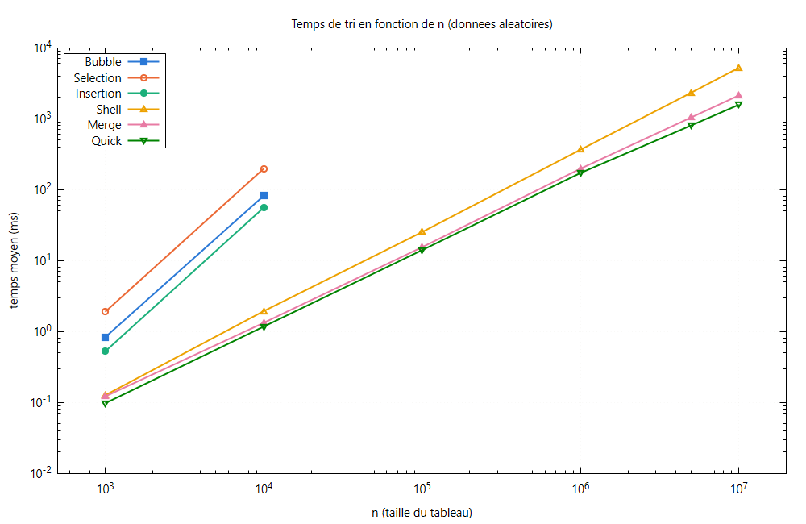

# Projet de comparaison des algorithmes de tri

Comparaison expérimentale de 6 algorithmes de tri en C : temps d'exécution, nombre de
comparaisons et nombre d'échanges, sur plusieurs tailles et plusieurs types de données.

## Où en est le projet

| Étape | État |
|---|---|
| Implémentation des 6 tris | ✅ Fait |
| Tests de validation | ✅ Fait (192 cas, tous passent) |
| Benchmark et fichiers CSV | ✅ Fait |
| Graphique temps = f(n) (gnuplot) | ✅ Fait |
| Rapport | ⏳ À faire |

## Structure du dépôt

```
include/
  sort.h                 déclaration des 6 tris + structure des compteurs
  generators.h           déclaration des générateurs de données
src/
  sort.c                 les 6 algorithmes de tri
  generators.c           génération des données de test (reproductibles)
  benchmark.c            programme de mesure, écrit les fichiers CSV
tests/
  test_sort.c            validation des tris avant toute mesure
scripts/
  graphique.gp           script gnuplot : graphique temps = f(n)
docs/
  temps_random.png       le graphique généré
Makefile                 compilation, tests, benchmark
resultats.csv            toutes les mesures brutes
resultats_statistiques.csv   moyenne et écart-type par (algorithme, type, n)
machine_info.txt         machine utilisée pour les mesures
```

## Ce qui est implémenté

### Les algorithmes ([src/sort.c](src/sort.c))

| Algorithme | Complexité | Remarque |
|---|---|---|
| Bubble (à bulles) | O(n²) | |
| Selection (sélection) | O(n²) | peu d'échanges (au plus n − 1) |
| Insertion | O(n²), O(n) si déjà trié | |
| Shell | ≈ O(n^1,5) | écarts n/2, n/4, …, 1 |
| Merge (fusion) | O(n log n) | un seul tableau temporaire alloué |
| Quick (rapide) | O(n log n) en moyenne | pivot au milieu, partition en 3 zones (<, =, > pivot), récursion sur la plus petite partie |

Tous les tris ont la même signature :

```c
void xxx_sort(int *array, size_t size, sort_stats_t *stats);
```

Ils trient le tableau en place et comptent les comparaisons et les échanges dans `stats`.
« Échanges » désigne les écritures dans le tableau : de vrais échanges pour Bubble,
Selection et Quick, des décalages pour Insertion et Shell, des recopies pour Merge.

### Les données de test ([src/generators.c](src/generators.c))

- `random` : valeurs aléatoires entre 0 et 999 999, graine fixe (donc reproductibles)
- `sorted` : déjà trié (0, 1, 2, …)
- `reverse` : trié à l'envers
- `duplicates` : seulement 100 valeurs différentes, répétées

### La validation ([tests/test_sort.c](tests/test_sort.c))

6 tris × 4 types de données × 8 tailles (0, 1, 2, 3, 10, 17, 50, 200) = 192 cas.
Chaque résultat doit être **trié** et être une **permutation** des données d'origine.

### Le benchmark ([src/benchmark.c](src/benchmark.c))

- Tailles : 1 000, 10 000, 100 000, 1 000 000, 5 000 000, 10 000 000
- Bubble, Selection et Insertion sont limités à n ≤ 50 000 (trop lents au-delà) ;
  ils ne sont donc mesurés qu'à 1 000 et 10 000.
- 5 répétitions par mesure, puis moyenne et écart-type d'échantillon (division par n − 1).
- Chronomètre : `timespec_get` (C11), précis en dessous de la milliseconde.
- Chaque résultat est comparé à une copie triée par `qsort` : si un tri est faux,
  le benchmark le signale et se termine avec le code 1.

## Formats des fichiers CSV

`resultats.csv` (une ligne par mesure) : **format imposé, ne pas modifier sans accord**.

```
algorithme,type_donnees,n,repetition,temps_ms,comparaisons,echanges
```

`resultats_statistiques.csv` (une ligne par algorithme × type × n) :

```
algorithme,type_donnees,n,moyenne_ms,ecart_type_ms
```

## Résultat principal



Axes en échelle logarithmique : une droite de pente k correspond à un temps en c·nᵏ.

- Bubble, Selection, Insertion : pente ≈ 2, donc **O(n²)**.
- Shell, Merge, Quick : pente ≈ 1,1, cohérent avec **O(n log n)**.
- Quick est le plus rapide à toutes les tailles (1,6 s pour 10 millions d'éléments),
  devant Merge (2,1 s) et Shell (5,2 s).

Machine utilisée : voir [machine_info.txt](machine_info.txt).

## Comment tout relancer

Prérequis : `gcc` et `make` (sous Windows avec MinGW : `mingw32-make`), et `gnuplot` pour le graphique.

```
make check                     # tests de validation
make bench                     # tests, puis benchmark si tout est valide (≈ 2 à 3 min)
gnuplot scripts/graphique.gp   # régénère docs/temps_random.png
make clean                     # supprime les exécutables (dossier build/)
```

Pour des mesures fiables sur un portable : chargeur branché, aucun autre programme lourd ouvert.

## Règles du projet

- Ne pas modifier le format de `resultats.csv` sans accord préalable.
- Les mesures doivent être reproductibles.
- Les algorithmes doivent être validés (`make check`) avant le benchmark.
